  

  <h1>Nicolas Ricardo Kourani Leão Silva</h1>

  

    Desenvolvedor Full Stack · Estudante de Análise e Desenvolvimento de Sistemas
  

  

    
    
  

  

    
    
  

## Sobre mim

Desenvolvo aplicações web, ferramentas empresariais e projetos acadêmicos, transformando processos reais em sistemas claros e seguros. Minha experiência inclui painéis administrativos, APIs REST, geração de documentos, fluxos operacionais e integrações com bancos e serviços em nuvem.

- 🎓 Análise e Desenvolvimento de Sistemas — SENAI Sorocaba
- 💻 Foco em desenvolvimento web full stack
- 🧩 Experiência com sistemas administrativos e operacionais
- 🔐 Interesse em segurança, organização e sustentabilidade de software
- 🚀 Publicação e manutenção de aplicações na Vercel e no Render

## Tecnologias

### Front-end

### Back-end e dados

### Ferramentas e infraestrutura

## Projetos em destaque

| Projeto | Descrição | Tecnologias |
|---|---|---|
| [Frameworks Front-end — Atividades](https://github.com/Nicolas1xx/frameworks-frontend-nicolas) | Atividades acadêmicas das aulas 01 a 05, incluindo aplicações e API REST. | JavaScript, React, Vue, Angular, Next.js, Node.js |
| [Gerador de Contratos](https://github.com/Nicolas1xx/GERADOR-DE-CONTRATOS-SISTEMA) | Sistema para criação, assinatura e acompanhamento de contratos e agendamentos. | Python, Flask, PostgreSQL |
| [Brasil do Futuro](https://github.com/Nicolas1xx/brasil-do-futuro) | Site institucional responsivo desenvolvido com tecnologias modernas de front-end. | React, TypeScript, Vite |
| [Multistore Catalog](https://github.com/Nicolas1xx/multistore-catalog) | Catálogo digital responsivo para produtos e pedidos. | React, TypeScript, Vite |
| [PsicoApp — Empreendedorismo](https://github.com/Nicolas1xx/PsicoApp---Emprendedorismo) | Aplicação acadêmica de apoio psicológico e empreendedorismo. | Python, Flask, Firebase |

## Experiência prática

- desenvolvimento de aplicações com Flask e Next.js;
- integração com PostgreSQL, SQLite, Supabase e Firebase;
- criação de dashboards, autenticação e fluxos administrativos;
- APIs REST e integração entre front-end e back-end;
- geração de documentos, relatórios e exportações;
- deploy de aplicações na Vercel e no Render;
- gestão segura de variáveis de ambiente, backups e credenciais.

## Estatísticas

  
  

## Contato

  

---

  Perfil inspirado no <a href="https://github.com/maurodesouza/profile-readme-generator">Profile README Generator</a>, de Mauro de Souza, e personalizado para Nicolas Ricardo.

